# Introduction to digital image processing.

## About
This project shows ideas that are in my opinion a must for anyone who wish to understand digital image processing.

Requirements:
*  knowledge Calculus linear algebra and probability.
* Matlab or Octave with image processing packages.

### Assignment 1 - Histogram shape.

In these assignment we wrote a function that receives a gray-scale image and returns a gray-scale image obtained by applying the histogram shape algorithm on this image where the histogram of the result image should match the histogram of the destimg.


#### The algorithm:

In order to implement the histShape algorithm we must first know more about:
1. [Histogram](https://en.wikipedia.org/wiki/Histogram "Histogram Wiki page")
1. [Cumulative histogram](https://en.wikipedia.org/wiki/Histogram#Cumulative_histogram "Cumulative histogram Wiki section")
1. [Histogram equalization](https://en.wikipedia.org/wiki/Histogram_equalization "Histogram equalization Wiki page")

#### Matlab code
```Matlab
function [ newImg ] = histShape( srcimg, destimg )
%histShape   This function creates new image from srcimg with destimg histogram.
%
%   INPUT PARAMETERS
%       srcimg     -   uint8 matrix
%       destimg    -   uint8 matrix
%
%   OUTPUT PARAMETERS
%       newImg     -   uint8 matrix (same size as  srcimg)
%

  OFFSET = 1;
  [N, M] = size(srcimg);
  cv = computeConversionVector(srcimg, destimg);
  newImg = zeros(size(srcimg), 'uint8');
  for i = 1:N
      for j = 1:M
          newImg(i, j) = cv(srcimg(i, j) + OFFSET); 
      end
  end
end
```

[For the rest of the code click here.](Assignment1/histShape.m "histShape code")

<!-- ##### Histograms:

>A histogram is an accurate representation of the distribution of numerical data. It is an estimate of the probability distribution of a >continuous variable and was first introduced by Karl Pearson. It differs from a bar graph, in the sense that a bar graph relates two >variables, but a histogram relates only one. To construct a histogram, the first step is to "bin" (or "bucket") the range of values—that >is, divide the entire range of values into a series of intervals—and then count how many values fall into each interval. The bins are >usually specified as consecutive, non-overlapping intervals of a variable. The bins (intervals) must be adjacent, and are often (but are >not required to be) of equal size.

##### Cumulative histogram:

>A cumulative histogram is a mapping that counts the cumulative number of observations in all of the bins up to the specified bin.

##### Histogram equalization:


##### Histogram shape: -->

### Example:
#### Source image:  


#### Destination image: 


```Matlab
% Let srcimg be the Source image
% Let destimg be the image we wish to match it's histogram.
srcimg = imread('darkimg.tiff');
destimg - imread('flatHist.tiff');
output = histShape(srcimg, destimg);
imshow(srcimg); figure; imshow(destimg); figure; imshow(output);
```

#### Output image: 


### Assignment 2 - Enhancing images
This assignment was about image enhancement from different types of noise from an image.
More about the topic can be found [here](http://www.cs.haifa.ac.il/~dkeren/ip/lecture3.pdf)

### Directional smoothing
In this part of the assignment we wrote a function which receive an image and add gaussian noise to the image with mean value 0, and var=0.004, and then we've try to enhance the image using the directional smoothing. It is up to us, to choose the right directional filters (size, orientation, and values).

__Function signature__ :
```Matlab
function [eImg,nImg] = gaussEnhance(img)
```
#### The algorithm:


#### Note:
One should pay attention for overfitting the filters to the noised image.


#### Matlab code
```Matlab
function [newImg] = computeSmoothenImage(img, c1, c2, c3, c4, c5, c6, c7)
% Computes the smoothen image form the img and the image after filters
% by choosing the closest value from filtered image to the original image at
% position i, j.
  [N, M] = size(img);
  newImg = zeros(size(img));
   
  for i = 1:N
    for j = 1:M
      val = img(i, j);
      filtered = [c1(i, j), c2(i, j), c3(i, j), c4(i, j), c5(i, j), c6(i, j), c7(i, j)];
      [_, I] = min(abs(val - filtered));
      newImg(i, j) = filtered(I);
    end
  end
end
```


### Example:
#### Input image:


#### Noised image:


```Matlab
img = imread('house.tiff');
[eImg,nImg] = gaussEnhance(img)
```

#### Enhanced image:


### Shape enhance
In this part we've wrote a function which receive an image and add shaped noise given by the following matrix: 
```Matlab 
[1,0,0,0,1;1,0,0,0,1;0,1,0,1,0;0,1,0,1,0;0,0,1,0,0]
```

The function should then try to enhance the image using myMedian filter.

__Function signature__ :
```Matlab
function [eImg,nImg] = shapesEnhance(img)
```
#### The algorithm:
Due to the shape of the noise we can apply a median filter of the shape `(1, 5)` to enhance the image.


#### Matlab code
```Matlab
eImg = myMedian(nImg, 5, 1);
```
### Example:

#### Input image:


#### Noised image:


```Matlab
img = imread('house.tiff');
[eImg,nImg] = shapesEnhance(img)
```

#### Enhanced image:


### Assignment 3 - Binary images:
This assignment was about binary images. More about the topic can be found [here](https://en.wikipedia.org/wiki/Binary_image "Binary images Wiki page").

### Connected components:
In this part we've wrote a matlab function which finds the connected components in a binary image and returns a matrix with the same size in which each connected component is tagged with a different label. The tags should be sequential.

More about connected components can be found
[here](https://en.wikipedia.org/wiki/Connected-component_labeling " Connected-component Wiki page").

__Function signature__ :
```Matlab
function [newImg] = tagConnectedComponents(img)
```

#### The algorithm:
This algorithm considers 4-connectivity.

Let I be the input image size N x M.
1. Initialize connected component matrix:
![equation](https://latex.codecogs.com/gif.latex?%5C%5C%20Let%20%5C%20I%20%5C%20be%20%5C%20a%20%5C%20binary%20%5C%20image%20%5C%20of%20%5C%20size%20%5C%20N%20%5Ctimes%20M.%5C%5C%20T%20%3A%3D%20zeros%20%5C%20matrix%20%5C%20of%20%5C%20size%20%5C%20N&plus;1%20%5Ctimes%20M&plus;1.%5C%5C%20tag%20%3A%3D%200%20%5C%5C%20%5C%5C%20%5Cforall%20%5C%20i%2C%20j%20%5C%202%5Cleq%20i%20%5Cleq%20N&plus;1%20%5C%20and%20%5C%202%20%5Cleq%20j%20%5Cleq%20M&plus;1%20%5C%5C%20%5Cindent%20if%20%5C%20I%28i-1%2C%20j-1%29%20%3D%201%3A%20%5C%5C%20%5Cindent%20%5Cindent%20%5C%20if%20%5C%20T%28i-1%2Cj%29%20%3E%200%20%5C%20and%20%5C%20T%28i%2C%20j-1%29%20%3E%200%3A%5C%5C%20%5Cindent%20%5Cindent%20%5Cindent%20T%28i%2C%20j%29%20%3D%20min%20%5Cleft%20%5C%7B%20T%28i-1%2C%20j%29%2C%20T%28i%2C%20j-1%29%20%5Cright%20%5C%7D%20%5C%20%5C%5C%20%5Cindent%20%5Cindent%20else%20%5C%20if%20T%28i-1%2Cj%29%20%3E%200%3A%20%5C%5C%20%5Cindent%20%5Cindent%20%5Cindent%20T%28i%2C%20j%29%20%3D%20T%28i-1%2C%20j%29%20%5C%5C%20%5Cindent%20%5Cindent%20else%20%5C%20if%20T%28i%2Cj-1%29%20%3E%200%3A%20%5C%5C%20%5Cindent%20%5Cindent%20%5Cindent%20T%28i%2C%20j%29%20%3D%20T%28i%2Cj-1%29%20%5C%5C%20%5Cindent%20%5Cindent%20else%3A%20%5C%5C%20%5Cindent%20%5Cindent%20%5Cindent%20tag%20%3D%20tag%20&plus;%201%20%5C%5C%20%5Cindent%20%5Cindent%20%5Cindent%20T%28i%2C%20j%29%20%3D%20tag)

1. Calculate equivalence table EQ:

    ![equation](https://latex.codecogs.com/gif.latex?%5C%5C%20Let%20%5C%20t%20%5C%20be%20%5C%20the%20%5C%20number%20%5C%20of%20%5C%20unique%20%5C%20tags%20%5C%20in%20%5C%20T%20%5C%5C%20EQ_0%20%3A%3D%20diagonal%20%5C%20matrix%20%5C%20of%20%5C%20ones%20%5C%20with%20%5C%20size%20%5C%20t%20%5Ctimes%20%5C%20t%5C%5C%20%5Cforall%20%5C%20i%2Cj%20%5C%202%20%5Cleq%20i%20%5Cleq%20N%20&plus;%201%20%5C%20and%20%5C%202%20%5Cleq%20j%20%5Cleq%20M%20&plus;%201%20%5C%5C%20if%20%5C%20T%28i%2C%20j%29%20%3E%200%5C%5C%20%5Cindent%20p%20%3D%20T%28i%2C%20j%29%5C%5C%20%5Cindent%20T%28i-1%2C%20j%29%20%3E%200%20%5C%5C%20%5Cindent%20%5Cindent%20%5Cindent%20q%20%3D%20T%28i-1%2C%20j%29%5C%5C%20%5Cindent%20%5Cindent%20%5Cindent%20EQ_0%28p%2C%20q%29%20%3D%20EQ_0%28p%2C%20q%29%20&plus;%201%20%5C%5C%20%5Cindent%20%5Cindent%20%5Cindent%20EQ_0%28p%2C%20q%29%20%3D%20EQ_0%28q%2C%20p%29%20&plus;%201%20%5C%5C%20%5Cindent%20T%28i%2C%20j-1%29%20%3E%200%20%5C%5C%20%5Cindent%20%5Cindent%20%5Cindent%20q%20%3D%20T%28i%2C%20j-1%29%5C%5C%20%5Cindent%20%5Cindent%20%5Cindent%20EQ_0%28p%2C%20q%29%20%3D%20EQ_0%28p%2C%20q%29%20&plus;%201%20%5C%5C%20%5Cindent%20%5Cindent%20%5Cindent%20EQ_0%28p%2C%20q%29%20%3D%20EQ_0%28q%2C%20p%29%20&plus;%201%20%5C%5C%20Repeat%3A%20%5C%5C%20%5Cindent%20EQ_i%20%3D%20EQ_%7Bi-1%7D%20*%20EQ_%7Bi-1%7D%20%5C%5C%20%5Cindent%20EQ_i%20%3D%20min%281%2C%20EQ_i%29%20%5C%5C%20Until%3A%20%5C%20EQ_i%20%3D%20EQ_%7Bi-1%7D)

1. Create conversion vector:

    

1. Convert the tags of T by the conversion vector.

#### Matlab code
```Matlab
function [newImg] = tagConnectedComponents(img)
% This function  finds the connected components in a binary image and returns a 
%matrix with the same size in which each connected components is tagged with a 
%different label in a sequential manner.
%
%   INPUT PARAMETERS
%       img     -   binary image
%       
%   OUTPUT PARAMETERS
%       newImg     -   matrix of doubles
%

  pImg = padarray (img, [1, 1], 'pre');
  [tagMatrix] = initTagMatrix(pImg);
  eqTable = makeEqTalbe(tagMatrix);
  cv = makeConvertionVector(eqTable);
  newImg = tagImage(tagMatrix, cv); 
  newImg = newImg(2:end, 2:end);
  
end
```


### Example:
#### Input image:
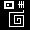

```Matlab
img = imread('binary1.tiff');
output = tagConnectedComponents(img);
```

#### Output:
```Matlab
   0   0   0   0   0   0   0   0   0   0   0   0   0   0   0   0   0   0   0   0   0   0   0   0   0   0   0   0   0   0
   0   0   0   0   1   1   1   1   1   1   1   1   1   1   0   0   0   0   0   2   0   2   0   2   0   0   0   0   0   0
   0   0   0   0   1   1   1   1   1   1   1   1   1   1   0   0   0   0   0   2   0   2   0   2   0   0   0   0   0   0
   0   0   0   0   1   1   0   0   0   0   0   0   1   1   0   0   0   0   0   2   0   2   0   2   0   0   0   0   0   0
   0   0   0   0   1   1   0   3   3   0   0   0   1   1   0   0   0   0   2   2   2   2   2   2   0   0   0   0   0   0
   0   0   0   0   1   1   0   3   3   0   0   0   1   1   0   0   0   0   0   2   0   2   0   2   0   0   0   0   0   0
   0   0   0   0   1   1   0   0   0   0   0   0   1   1   0   0   0   0   0   2   0   2   0   2   0   0   0   0   0   0
   0   0   0   0   1   1   1   1   1   1   1   1   1   1   0   0   0   0   0   2   0   2   0   2   0   0   0   0   0   0
   0   0   0   0   1   1   1   1   1   1   1   1   1   1   0   0   0   0   0   0   0   0   0   0   0   0   0   0   0   0
   0   0   0   0   0   0   0   0   0   0   0   0   0   0   0   0   0   0   0   0   0   0   0   0   0   0   0   0   0   0
   0   0   0   0   0   0   0   0   0   0   0   0   0   0   0   0   0   0   0   0   0   0   0   4   0   0   0   0   0   0
   0   0   0   0   0   0   0   0   0   0   0   0   0   0   0   0   0   0   0   0   0   0   0   4   0   0   0   0   0   0
   0   0   0   0   0   0   0   0   0   9   9   9   9   9   9   9   9   9   9   9   9   9   9   4   0   0   0   0   0   0
   0   0   0   0   0   0   0   0   0   9   0   0   0   0   0   0   0   0   0   0   0   0   0   0   0   0   0   0   0   0
   0   0   0   0   0   0   0   0   0   9   0   0   0   0   0   0   0   0   0   0   0   0   0   0   0   0   0   0   0   0
   0   0   0   0   0   0   0   0   0   9   0   0   0   0   9   9   9   9   9   9   9   9   9   9   0   0   0   0   0   0
   0   0   0   0   0   0   0   0   0   9   0   0   0   0   9   0   0   0   0   0   0   0   0   9   0   0   0   0   0   0
   0   0   0   0   0   0   0   0   0   9   0   0   0   0   9   0   0   0   0   0   0   0   0   9   0   0   0   0   0   0
   0   0   0   0   0   0   0   0   0   9   0   0   0   0   9   0   0   5   5   5   5   0   0   9   0   0   0   0   0   0
   0   0   0   0   0   0   0   0   0   9   0   0   0   0   9   0   0   5   0   0   5   0   0   9   0   0   0   0   0   0
   0   0   0   0   0   0   0   0   0   9   0   0   0   0   9   0   0   5   0   0   5   0   0   9   0   0   0   0   0   0
   0   0   0   0   0   0   0   0   0   9   0   0   0   0   9   0   0   0   0   0   5   0   0   9   0   0   0   0   0   0
   0   0   0   0   0   0   0   0   0   9   0   0   0   0   9   0   0   0   0   0   5   0   0   9   0   0   0   0   0   0
   0   0   0   0   0   0   0   0   0   9   0   0   0   0   9   9   9   9   9   9   9   0   0   9   0   0   0   0   0   0
   0   0   0   0   0   0   0   0   0   9   0   0   0   0   0   0   0   0   0   0   0   0   0   9   0   0   0   0   0   0
   0   0   0   0   0   0   0   0   0   9   0   0   0   0   0   0   0   0   0   0   0   0   0   9   0   0   0   0   0   0
   0   0   0   0   0   0   0   0   0   9   9   9   9   9   9   9   9   9   9   9   9   9   9   9   0   0   0   0   0   0
   0   0   0   0   0   0   0   0   0   0   0   0   0   0   0   0   0   0   0   0   0   0   0   0   0   0   0   0   0   0
   0   0   0   0   0   0   0   0   0   0   0   0   0   0   0   0   0   0   0   0   0   0   0   0   0   0   0   0   0   0
   0   0   0   0   0   0   0   0   0   0   0   0   0   0   0   0   0   0   0   0   0   0   0   0   0   0   0   0   0   0
```


### Skeletonize:
In this part we've wrote a matlab function which skeletonize objects in a given binary image and returns a new binary image.

__Function signature__ :
```Matlab
function [newImg] = skeletonizeImage(img)
```

#### The algorithm:

1. Calculate distance from background for each pixel.
1. Mark every index where the pixel value is greater or equal to it's 4-connectivity neighborhood.

### Example:
#### Input image:
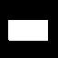

```Matlab
bwImg = imread('binaryRect.tiff');
output = skeletonizeImage(bwImg);
```

#### Output:
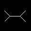


### Assignment 4 - Edge detection and Hough transform:

### Canny edge detector:
In this part of the Assignment we've implemented the Canny edge detector algorithm, more about it can be found [here](https://en.wikipedia.org/wiki/Canny_edge_detector "Canny edge detector Wiki page").

__Function signature__ :
```Matlab
function [newImg, tgTeta] = edgeDetect(img)
```


#### The algorithm:
The algorithm can be found [here](https://en.wikipedia.org/wiki/Canny_edge_detector#Process_of_Canny_edge_detection_algorithm "Process of Canny edge detection algorithm")


### Example:
#### Input image:
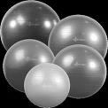

```Matlab
img = im2double(imread('balls4.tiff'));
output = edgeDetect(img);

```

#### Output:
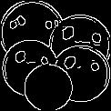


### Circle Hough Transform:
In this part of the Assignment we've implemented the Hough transform algorithm to find circles in an image, more about it can be found [here](https://en.wikipedia.org/wiki/Circle_Hough_Transform "Circle Hough Transform").

__Function signature__ :
```Matlab
function [circles,cImg] = findCircles(img)
```

#### The algorithm:
The algorithm can be found [here](https://en.wikipedia.org/wiki/Circle_Hough_Transform#Theory "Circle Hough Transform theory")

### Example:
#### Input image:


```Matlab
img = im2double(imread('balls4.tiff'));
output = edgeDetect(img);
```

#### Output:
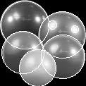


### Assignment 5 - Fourier transform:
In this assignment we've cleaned images in the frequency domain.

__Function signature__ :
```Matlab
function [cImg1,cImg2,cImg3,cImg4] = fftClean(img1,img2,img3,img4)
```

#### The algorithm:

### Example:
#### Inputs:


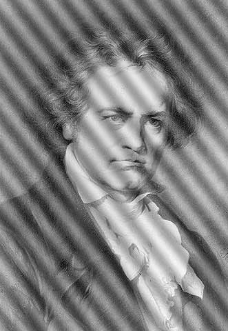


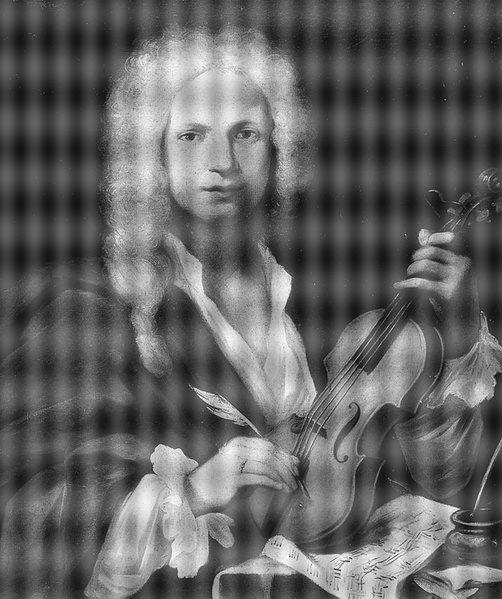


```Matlab
fft1 = im2double(imread('fft1.tiff'));
fft2 = im2double(imread('fft2.tiff'));
fft3 = im2double(imread('fft3.tiff'));
fft4 = im2double(imread('fft4.tiff'));

[cImg1,cImg2,cImg3,cImg4] = fftClean(fft1, fft2, fft3, fft4);
```

#### Outputs:

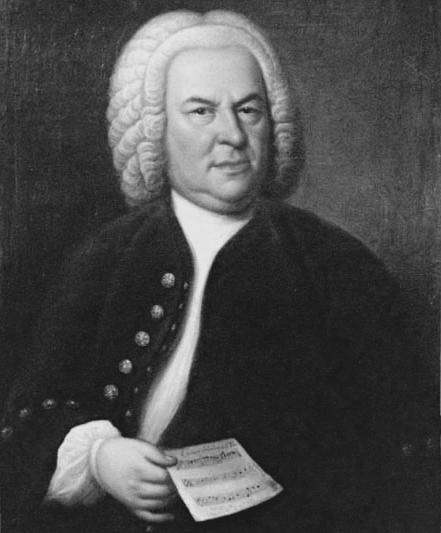


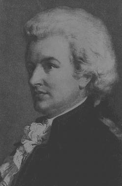

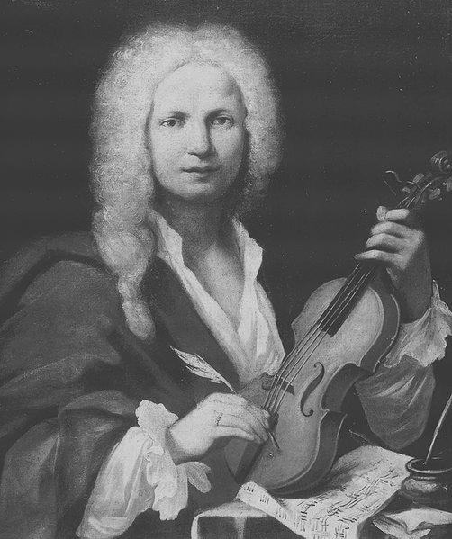

### Bonus Assignment :
Write a matlab function which receives 2 gray-scale image and creates a new image, which is consists of tiles of the small image which forms the big image. Each of the small image tiles is processed using the histShape function of Ex1 to match the histogram of the big image in the same location.

__Function signature__ :
```Matlab
function nImg = createTiledImage(bigImage, smallImage)
```

#### The algorithm:
1. Cut the big image to non overlapping parts of the size of the small image.
1. Match the histogram of the small image to each of parts.
1. Replace the parts with the matched small image.

### Example:
#### Inputs:


#### Output:

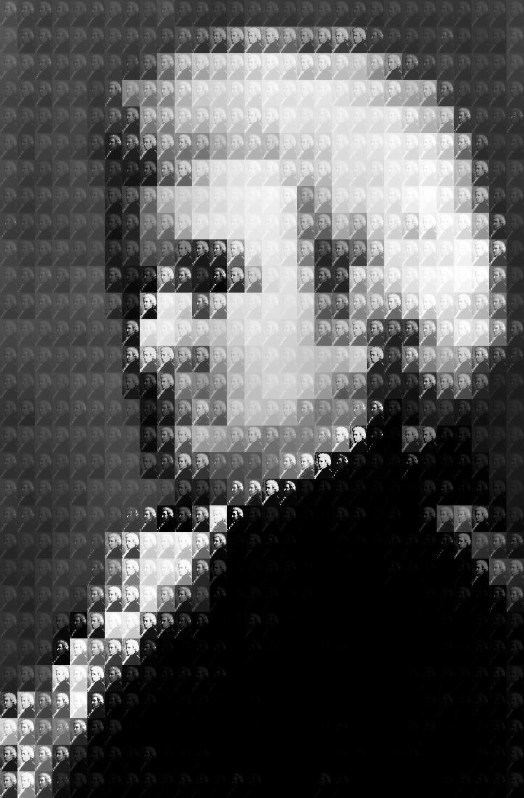