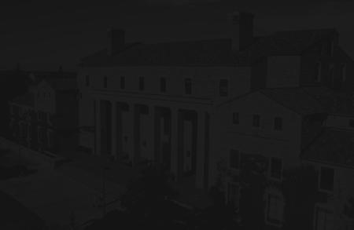
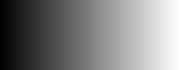
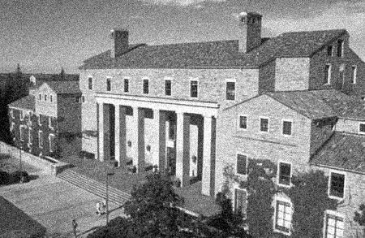
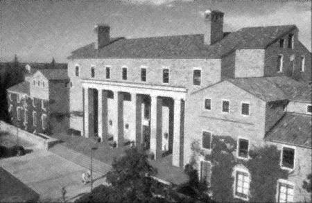

# Introduction to digital image processing.

## About
This project shows ideas that are in my opinion a must for anyone who wish to understand digital image processing.

Requirements:
*  knowledge Calculus linear algebra and probability.
* Matlab or Octave with image processing packages.

### Assignment 1 - Histogram shape.

In these assignment we wrote a function that receives a gray-scale image and returns a gray-scale image obtained by applying the histogram shape algorithm on this image where the histogram of the result image should match the histogram of the destimg.


#### The algorithm:

In order to implement the histShape algorithm we must first know more about:
1. [Histogram](https://en.wikipedia.org/wiki/Histogram "Histogram Wiki page")
1. [Cumulative histogram](https://en.wikipedia.org/wiki/Histogram#Cumulative_histogram "Cumulative histogram Wiki section")
1. [Histogram equalization](https://en.wikipedia.org/wiki/Histogram_equalization "Histogram equalization Wiki page")

#### Matlab code
```Matlab
function [ newImg ] = histShape( srcimg, destimg )
%histShape   This function creates new image from srcimg with destimg histogram.
%
%   INPUT PARAMETERS
%       srcimg     -   uint8 matrix
%       destimg    -   uint8 matrix
%
%   OUTPUT PARAMETERS
%       newImg     -   uint8 matrix (same size as  srcimg)
%

  OFFSET = 1;
  [N, M] = size(srcimg);
  cv = computeConversionVector(srcimg, destimg);
  newImg = zeros(size(srcimg), 'uint8');
  for i = 1:N
      for j = 1:M
          newImg(i, j) = cv(srcimg(i, j) + OFFSET); 
      end
  end
end
```

[For the rest of the code click here.](Assignment1/histShape.m "histShape code")

<!-- ##### Histograms:

>A histogram is an accurate representation of the distribution of numerical data. It is an estimate of the probability distribution of a >continuous variable and was first introduced by Karl Pearson. It differs from a bar graph, in the sense that a bar graph relates two >variables, but a histogram relates only one. To construct a histogram, the first step is to "bin" (or "bucket") the range of values—that >is, divide the entire range of values into a series of intervals—and then count how many values fall into each interval. The bins are >usually specified as consecutive, non-overlapping intervals of a variable. The bins (intervals) must be adjacent, and are often (but are >not required to be) of equal size.

##### Cumulative histogram:

>A cumulative histogram is a mapping that counts the cumulative number of observations in all of the bins up to the specified bin.

##### Histogram equalization:


##### Histogram shape: -->

### Example:
#### Source image:  


#### Destination image: 


```Matlab
% Let srcimg be the Source image
% Let destimg be the image we wish to match it's histogram.
srcimg = imread('darkimg.tiff');
destimg - imread('flatHist.tiff');
output = histShape(srcimg, destimg);
imshow(srcimg); figure; imshow(destimg); figure; imshow(output);
```

#### Output image: 


### Assignment 2 - Enhancing images
This assignment was about image enhancement from different types of noise from an image.
More about the topic can be found [here](http://www.cs.haifa.ac.il/~dkeren/ip/lecture3.pdf)

### Directional smoothing
In this part of the assignment we wrote a function which receive an image and add gaussian noise to the image with mean value 0, and var=0.004, and then we've try to enhance the image using the directional smoothing. It is up to us, to choose the right directional filters (size, orientation, and values).

__Function signature__ :
```Matlab
function [eImg,nImg] = gaussEnhance(img)
```
#### The algorithm:


#### Note:
One should pay attention for overfitting the filters to the noised image.


#### Matlab code
```Matlab
function [newImg] = computeSmoothenImage(img, c1, c2, c3, c4, c5, c6, c7)
% Computes the smoothen image form the img and the image after filters
% by choosing the closest value from filtered image to the original image at
% position i, j.
  [N, M] = size(img);
  newImg = zeros(size(img));
   
  for i = 1:N
    for j = 1:M
      val = img(i, j);
      filtered = [c1(i, j), c2(i, j), c3(i, j), c4(i, j), c5(i, j), c6(i, j), c7(i, j)];
      [_, I] = min(abs(val - filtered));
      newImg(i, j) = filtered(I);
    end
  end
end
```


### Example:
#### Input image:


#### Noised image:


```Matlab
img = imread('house.tiff');
[eImg,nImg] = gaussEnhance(img)
```

#### Enhanced image:



### Shape enhance
In this part we've wrote a function which receive an image and add shaped noise given by the following matrix: 
```Matlab 
[1,0,0,0,1;1,0,0,0,1;0,1,0,1,0;0,1,0,1,0;0,0,1,0,0]
```

The function should then try to enhance the image using myMedian filter.

__Function signature__ :
```Matlab
function [eImg,nImg] = shapesEnhance(img)
```
#### The algorithm:
Due to the shape of the noise we can apply a median filter of the shape `(1, 5)` to enhance the image.


#### Matlab code
```Matlab
eImg = myMedian(nImg, 5, 1);
```
### Example:

#### Input image:


#### Noised image:


```Matlab
img = imread('house.tiff');
[eImg,nImg] = shapesEnhance(img)
```

#### Enhanced image:


